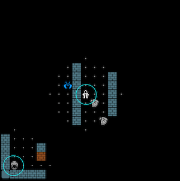
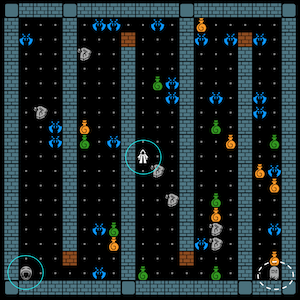

## Using JOCC by Example

As an example we will use the game MiniDungeon as our (System Under Test/SUT). This game is included in the packaging of iv4xr. This example is not meant to be complete; we just want to show the steps needed to use JOCC. Some screenshots are shown below. Players' avatars are circled in blue (one or two players can play in the same game). Players actually have limited sight; the screenshot to the left shows how the game actually look like for players. The screenshot on the right shows an entire game-level by artificially set the players' visibility range to unlimited.



In this game, the player can go from one level to the next one, until the final level. Access to the next level is guarded by a _shrine_, which can teleport the player to the next level. However, the shrine must be _cleansed_ first before it can be used as a teleporter. To cleanse it, the player needs to use a _scroll_ (gray icon in the game). There are usually several scrolls dropped in a level, but only one of them (a holy scroll) can do the cleansing. The player does not know which scroll is holy until it tries to use it on a shrine. There are also monsters in the levels that can hurt the player, but also potions that can heal the player or enhance its combat.

Imagine we want to run some test scenarios to see that the first level of MiniDungeon can generate tension. In terms of OCC, we want to see if one of these scenarios would generate the distress emotion, or at least fear.

#### 1. Determine the goals and relevant events.

As a goal of interest, let us take g = "a shrine is cleansed". If we specify this to JOCC, it means that emotions it produce would emotions with respect to this g. We could have more goals, but here let us just have g as our only goal of interest. Since the player starts in level-1 of the game, and there is only one shrine there, then g simply means the shrine of level-1 is cleansed.

Next we decide what "events" would be relevant towards this goal g. For this example let's just restrict to the following events:

   1. "OUCH": triggered when a monster hits/hurts the player.
   2. "HEAL": tiggered when the player heals itself by drinking a health potion.
   3. "SEESHRINE": triggered when the player sees level-1 shrine for the first time.
   4. "CLEANSE": triggered when the player manages to cleanse level-1 shrine.

The game does not actually produces these events as (it was not implemented using an event-system), but we would argue that players experience them as meaningful changes, hence "events". Since the game does not produce these events (as "objects" that we can intercept), we somehow have to produce them so that they are visible to JOCC. We can do this by implementing the abstract class `SyntheticEventsProducer`. A fragment of this implementation for MiniDungeon is shown below:

```Java
public class MiniDungeonEventsProducer extends SyntheticEventsProducer {
  ...
  public void generateCurrentEvents() {
     ...
     var player = wom.elements.get(wom.agentId) ;
     var prevState = player.getPreviousState() ;
     if (..) // if player's hp < its hp in the prevState
        currentEvents.add(OUCH) ;
    ...
  }
}
```

The [full implementation is here](../src/main/java/nl/uu/cs/aplib/exampleUsages/miniDungeon/testAgent/MiniDungeonEventsProducer.java).


#### 2. Constructing a Player Characterization

Next we need to provide a "model" of the game players ("model" is of course a very foggy word; we will clarify this in a minute).
Indeed, users may have different play styles, so we may want to construct different models representing different play styles.
For our example, let's just have one model :)

Let us first specify a goal, towards which we want to know what kind of emotions players might have. As an example, let's consider "cleansing the shrine in level-0" as a goal:

```Java
Goal shrineCleansed = new Goal("A shrine is cleansed.")
     . withSignificance(8) ;
```

Later we will register this goal to JOCC.
For JOCC a goal is just a string and some number representing its relative importance compared to other goals. Since in this example we will only have one goal, this number is not important.

In JOCC, a player-model, also called a _player characterization_, is a class that implements the abstract class `XUserCharacterization`. We show below the methods that need to be implemented:

```java
public class MiniDungeonPlayerCharacterization extends XUserCharacterization {
   public void eventEffect(XEvent e, BeliefBase beliefbase) ...
   public int desirabilityAppraisalRule(Goals_Status goals_status, String eventName, String goalName) ...
   public int emotionIntensityDecayRule(EmotionType etype) ...
   public int intensityThresholdRule(EmotionType etyp) ...
}
```

  * `intensityThresholdRule(ety)` specifies what would the the threshold value for producing an emotion of type ety (e.g. fear). The underlying calculation first infers a raw intensity (also called potential intensity). The threshold is subtracted from this raw intensity value. This becomes the output intensity, but only if it is non-negative.

  For the exact formula used to calculate the raw intensity, see [Ansari et al. _An Appraisal Transition System for Event-Driven Emotions in Agent-Based Player Experience Testing_](https://arxiv.org/pdf/2105.05589).

  * `emotionIntensityDecayRule(ety)` specifies has fast intensity decays.

  * `desirabilityAppraisalRule(status,e,g)` specifies how desirable an event e would be, towards achieving the goal g.

  * `eventEffect(e,B)` descrives how the event e would affect the player's (that is, the player that we are modelling) perception on the likelihood on achieving different goals. B is a model of what the player's currently believe (e.g. it might believe that achieving a goal g is still possible).

For the work out, please see the [full code of MiniDungeonPlayerCharacterization can be seen here](../src/main/java/nl/uu/cs/aplib/exampleUsages/miniDungeon/testAgent/MiniDungeonPlayerCharacterization.java).

#### 3. Putting things together

We will first create an Emotive test-agent and also create an instance of the MiniDungeon game. Then we attach to it agent: a state, an 'environment' that interfaces it with the game, and the event producer we discussed before:

```Java
var agent          = new EmotiveTestAgent("Frodo","Frodo") ;
DungeonApp app     = deployApp() ;

var state = ...
agent. attachState(state)
     . attachEnvironment(new MyAgentEnv(app))
     . attachSyntheticEventsProducer(new MiniDungeonEventsProducer()) ;
```


Next, we need an instance of JOCC. This is implemented by the class `Iv4xrOCCEngine`, so we can create an instance of the latter. This OCC-engine will need to be attached to our emotive test-agent. We also need to attach the player-characterzation we wrote above:


```Java
var occEngine = new Iv4xrOCCEngine(agent.getId())
   . attachToEmotiveTestAgent(agent)
   . withUserModel(new MiniDungeonPlayerCharacterization()) ;
```

Next, we register our "cleanse the shrine" goal to the OCC-engine above. We also add initial emotions (it would set the likelihood of the `shrineCleansed`-goal to 0.5, and also add initial hope and fear towards this goal to 0.5 the maximum intensity).


```Java
occEngine.addGoal(shrineCleansed, 70) ;
occEngine.addInitialEmotions();

```

Now we are ready to do a test. JOCC itself only provides a system to calculates if, and which, emotions would emerge. JOCC cannot on its own trigger any execution on the MiniDungeon Game. You will need a test scenario, that will interact with the game, e.g. to try to get to the level-0 shrine and cleanse it. Using iv4xr we can program with with goals. The game MiniDungeon already comes with a set of basic goals (and tactics). Let's use this to program a test scenario. The scenario below guides the test-agent to automatically play the game. It is programmed to first get a scroll with id `S0_1`, then it goes to the shrine of level-0, and use the scroll there (which then would cleanse the shrine).

```Java
var goalLib = new GoalLib(); // MiniDungeon's goal-library
var G = SEQ(goalLib.smartEntityInCloseRange(agent, "S0_1"),
   goalLib.entityInteracted("S0_1"),
   goalLib.smartEntityInCloseRange(agent, "SM0"),
   goalLib.entityInteracted("SM0"),
   SUCCESS());

agent.setGoal(G)   
```

Now we are ready to run the test. We run the agent in an update-loop, until the goal G is either achieved or failed. After each update you can inspect the emotion-state, e.g. to check is a certain emotion is present:

```Java
while (G.getStatus().inProgress()) {
  agent.update();
  // the agent does a single update, after which we can inspect the emotion-state
  // e.g. to check if emotionState.fear() > 0
}
```

#### 4. Verifying UX property

We can also use Linear Temporal Logic (LTL) to express a UX requirement as an LTL formula and then check it on a run such as the one above, as shown below:

```Java
// eventually there is an increase in fear's intensity:
LTL<SimpleState> f1 = eventually(S ->
   getEmotionState(S).difFear(shrineCleansed.name) != null
   && getEmotionState(S).difFear(shrineCleansed.name) > 0) ;

// eventually there is an increase in distress' intensity:
LTL<SimpleState> f2 = eventually(S ->
    getEmotionState(S).difDistress(shrineCleansed.name) != null
    && getEmotionState(S).difDistress(shrineCleansed.name) > 0) ;
```

We can now add these formulas to the agent, and asks it to re-run the previous scenario:

```Java
agent.addLTL(f1,f2) ;
while (G.getStatus().inProgress()) agent.update();
assertTrue(agent.evaluateLTLs()) ;
```
### Example

For an example of a JUnit test that runs a UX test see the class [TestDemoPX](src/main/java/nl/uu/cs/aplib/exampleUsages/miniDungeon/TestDemoPX.java)/

### [API References](https://iv4xr-project.github.io/apidocs/jocc/javadocs/index.html)

### Relevant papers

[_An Appraisal Transition System for Event-Driven Emotions in Agent-Based Player Experience Testing_](https://doi.org/10.1007/978-3-030-97457-2_9), Ansari, Prasetya, Dastani, Dignum, Keller. In International Workshop on Engineering Multi-Agent Systems (EMAS), 2021.

[_Toward automated assessment of user experience in extended reality_](https://doi.org/10.1109/ICST46399.2020.00056), or [here](https://csdl-downloads.ieeecomputer.org/proceedings/icst/2020/5778/00/09159046.pdf?Expires=1671204401&Policy=eyJTdGF0ZW1lbnQiOlt7IlJlc291cmNlIjoiaHR0cHM6Ly9jc2RsLWRvd25sb2Fkcy5pZWVlY29tcHV0ZXIub3JnL3Byb2NlZWRpbmdzL2ljc3QvMjAyMC81Nzc4LzAwLzA5MTU5MDQ2LnBkZiIsIkNvbmRpdGlvbiI6eyJEYXRlTGVzc1RoYW4iOnsiQVdTOkVwb2NoVGltZSI6MTY3MTIwNDQwMX19fV19&Signature=MRWiQrFdNwvBDyohmP9a9Jj9BPBNqqHgINRCinU46msptLeoKCvpdVtY~~SwFkhCDmCROmn36i0nvYCzXueSABEyYqvGCSfJiJEMMLI9SgCqw8dT21PDz7XzXPIvuSOEDTwo7DgbRrOJ7wjY7DTKcc1eKQZTn02o3pOCRksyXIb0bKM7y~ncaxS7dUcI9-h7R4CpvlbD-j5YL3q3oqYTveKvt5oj2GMpVAgfQ2hCyufSI2WZCiBjMZr1-ZC0W~kuHJf6aUlF6i1UMjndJPfLour-40QMWp8kUpKEqMUoEvepa-J3XTbC1M~HNsHRiZzNadHPgohp5ByZCBlA65V4Qg__&Key-Pair-Id=K12PMWTCQBDMDT),
Ansari, Saba Gholizadeh.
In 2020 IEEE 13th international conference on software testing, validation and verification (ICST), pp. 430-432. IEEE, 2020.
